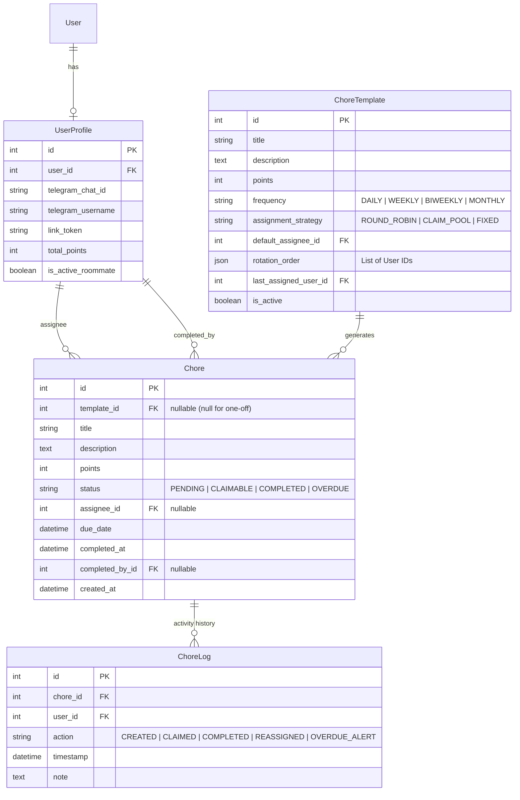

# Project Specification & Implementation Plan: Household Chore Manager

## 1. Executive Summary
The **Household Chore Manager** is a full-featured, collaborative task management system designed specifically for shared apartments and households. It combines an interactive, modern web dashboard with an automated 1-on-1 Telegram bot to keep housemates aligned, distribute chores equitably, and eliminate chore-related friction.

---

## 2. Core Architecture & Tech Stack

| Component | Technology | Rationale |
| :--- | :--- | :--- |
| **Backend Framework** | **Django 5.x (Python 3.11+)** | Batteries-included, built-in ORM, admin panel, authentication, and secure session management. |
| **Database** | **SQLite (dev) / PostgreSQL (prod-ready)** | Zero-configuration local development while keeping models fully portable. |
| **Frontend UI** | **Django Templates + HTMX + Modern Vanilla CSS** | Delivers a dynamic SPA-like user experience (instant claiming, status updates, modal forms) without a heavy Node/npm build toolchain. |
| **Telegram Integration** | **Telegram Bot API (Long Polling via `getUpdates`)** | Requires zero public URLs, webhooks, or tunnels (e.g., `ngrok`) for local development. |
| **Scheduling Engine** | **In-process APScheduler (Background Thread)** | Periodically generates recurring chores, checks upcoming/overdue deadlines, and dispatches Telegram notifications directly within the application process. |

---

## 3. Domain & Scope Decisions

1. **Single Household Scope**:
   - The application manages a single household unit.
   - All registered housemate users participate in the same pool of chores and leaderboard.
   - Simplifies permissions, URLs, and database queries.

2. **Chore Assignment Mechanics**:
   - **Round-Robin Rotation**: Repeating chores cycle automatically to the next roommate in a defined order upon completion or weekly reset.
   - **Claim Board (Backlog Pool)**: Open, unassigned chores that any housemate can volunteer to take.
   - **Direct Assignment**: Tasks explicitly assigned to a specific housemate with a firm deadline.
   - **Points & Effort Balance**: Chores have point weights (e.g., Quick Trash = 1 pt, Kitchen Deep Clean = 5 pts). A live leaderboard tracks total and monthly contributions.

3. **Hybrid Chore Lifecycle**:
   - **One-off Tasks**: Ad-hoc duties with a single deadline (e.g., "Fix squeaky door", "Replace water filter").
   - **Recurring Templates**: Schedules (Daily, Weekly, Bi-weekly, Monthly) that generate active chore instances automatically.

4. **Telegram Bot Interaction Model**:
   - **Direct Messages (1-on-1)**: The bot communicates directly with individual roommates rather than cluttering a group chat.
   - **Interactive Actions**: Inline keyboards allow users to tap **[Claim]** or **[Mark Done]** directly within Telegram notifications.
   - **Account Pairing**: Roommates visit their web profile, click a deep link (`https://t.me/<BotName>?start=<TOKEN>`), and the bot pairs their Telegram `chat_id` instantly.

---

## 4. Data Models & Database Schema



---

## 5. Web Application User Experience (HTMX + CSS)

### Design & Theme
- **Clean, Modern Aesthetic**: Card-based layouts, dark/light theme support, accessible typography, subtle micro-animations.
- **Dynamic Board**:
  - **Tabs / Filters**: "My Chores", "Available to Claim (Pool)", "All Household Chores", "Completed This Week".
  - **Action Buttons**: Instant HTMX `hx-post` for **[Claim]** and **[Complete]** with smooth DOM replacement (no full-page reload).
- **House Leaderboard & Stats**:
  - Highlights top contributors and points distribution for the week/month.
  - Visual indicator of effort fairness among roommates.
- **Chore Creation & Management**:
  - Unified modal/page for creating either a one-time task or a recurring template with rotation rules.
- **Profile / Telegram Connection**:
  - Display Telegram connection status with a single-click "Connect via Telegram" deep-link button.

---

## 6. Telegram Bot Design

### Commands & Interactions
- `/start`: Welcomes user; if a token is provided (`/start <token>`), completes account pairing.
- `/chores`: Lists chores currently assigned to the user, with inline **[Mark Done]** buttons.
- `/pool`: Lists unassigned chores available to claim, with inline **[Claim Task]** buttons.
- `/stats`: Displays current household points leaderboard.
- `/help`: Usage guide and command list.

### Automated Notifications Dispatched via Bot
1. **Assignment Notification**: Sent when a round-robin chore is assigned to the user or when a deadline approaches.
2. **Upcoming / Overdue Alerts**: Gentle nudge sent 24 hours before a chore deadline and on the due date.
3. **Weekly Digest**: Summary of household achievements and points leaderboard sent every Sunday evening.

---

## 7. Project Directory Structure

```text
ai-dev-tools-zoomcamp-2026-hw01/
├── _docs/
│   └── plan.md                  # This master specification and implementation plan
├── chore_manager/               # Django project root
│   ├── __init__.py
│   ├── asgi.py
│   ├── settings.py
│   ├── urls.py
│   └── wsgi.py
├── chores/                      # Main application
│   ├── migrations/
│   ├── templates/
│   │   ├── base.html
│   │   ├── chores/
│   │   │   ├── dashboard.html
│   │   │   ├── partials/
│   │   │   │   ├── chore_card.html
│   │   │   │   ├── chore_list.html
│   │   │   │   ├── claim_pool.html
│   │   │   │   └── leaderboard.html
│   │   │   ├── chore_form.html
│   │   │   └── profile.html
│   │   └── registration/
│   │       └── login.html
│   ├── static/
│   │   ├── css/
│   │   │   └── styles.css       # Polished Vanilla CSS design system
│   │   └── js/
│   │       └── main.js
│   ├── management/
│   │   └── commands/
│   │       ├── run_bot.py       # Standalone long-polling Telegram bot worker
│   │       ├── seed_data.py     # Populates test users and sample chores
│   │       └── process_tasks.py # Manual trigger for recurring chores & alerts
│   ├── services/
│   │   ├── bot_service.py       # Telegram API wrapper and message dispatcher
│   │   ├── rotation_service.py  # Round-robin and points balance algorithms
│   │   └── scheduler.py         # APScheduler background task manager
│   ├── admin.py
│   ├── apps.py
│   ├── forms.py
│   ├── models.py
│   ├── urls.py
│   └── views.py
├── manage.py
├── requirements.txt
└── .env.example
```

---

## 8. Step-by-Step Implementation Roadmap

### Phase 1: Environment & Django Foundation
- Initialize virtual environment and create `requirements.txt` (`Django`, `apscheduler`, `python-dotenv`, `requests`).
- Set up Django project settings, timezone, static files, and `.env` configuration.
- Implement data models (`UserProfile`, `ChoreTemplate`, `Chore`, `ChoreLog`) and run initial migrations.
- Configure Django Admin with filters, search, and inline history logs.

### Phase 2: Web Interface & Dynamic Interactions (HTMX)
- Build responsive base layout with modern CSS (design system, cards, typography, badges).
- Build the main Dashboard with dynamic HTMX partials:
  - Chore list by status and personal assignment.
  - Claim pool board with instant one-click claim action.
  - Live household leaderboard showing points and completion counts.
- Add forms for creating one-off tasks and recurring templates.
- Implement User Profile page with Telegram linking status and deep-link generation.

### Phase 3: Core Business & Rotation Logic
- Implement rotation engine (`rotation_service.py`):
  - Round-robin assignee advancement logic.
  - Claiming and completion workflows with automatic points award.
- Create seed data script (`python manage.py seed_data`) to generate a realistic household with roommates, chores, and history for immediate testing.

### Phase 4: Telegram Bot Integration (Long Polling)
- Implement Telegram bot service (`bot_service.py`) supporting:
  - Deep-link token pairing (`/start <token>`).
  - Chore inquiry commands (`/chores`, `/pool`, `/stats`).
  - Inline keyboard callbacks for immediate action (`claim_<id>`, `done_<id>`).
- Create Django management command (`python manage.py run_bot`) for standalone long polling.

### Phase 5: In-Process Automation & Background Scheduler
- Configure `APScheduler` in `chores/apps.py` (or a dedicated background thread worker):
  - Generate upcoming instances from active `ChoreTemplate` entries.
  - Check for approaching and overdue deadlines.
  - Trigger Telegram DM notifications to assignees.

### Phase 6: Verification & Final Polish
- Test all user flows:
  1. Roommate logs in, creates a chore, connects Telegram.
  2. Housemate claims a chore on the web board via HTMX.
  3. Telegram bot sends reminder with inline button; housemate taps [Done] in Telegram.
  4. Web dashboard updates points on the leaderboard.
- Document setup instructions and testing guide in `README.md`.
